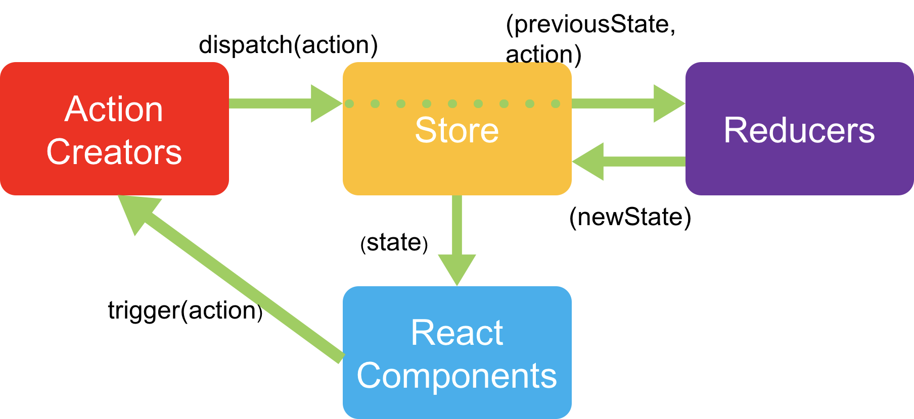

React & Vue 比较示例
===
## 介绍
本项目试图通过不同角度的具体例子来比较React和Vue在实际开发中的异同。  
- 项目结构：  
后台为Maven构建的Java项目，用以提供模拟的后台接口；  
```/src/main/js/reactdemo```为react部分代码  
```/src/main/js/vuedemo```为vue部分的代码

###  React 
1. #### 项目搭建
    ##### creat-react-app  
    - 适合创建单页面应用（如需创建服务端渲染的项目请使用Next.js）
    - 社区维护（虽然最近似乎转为官方维护）[链接](https://facebook.github.io/create-react-app/)
    - 简单的接口
    - 如若需要更多的功能则需要熟悉复杂的Webpack配置
    - 使用步骤（首次运行）：  
        1. 安装NodeJs LTS版本（建议将Npm源地址换成淘宝镜像以避免出现网络问题）  
        2. 安装
        3. 在工作目录运行```npx create-react-app 项目文件夹名（本例为reactdemo）```
        4. 转至项目，运行```yarn start```，在浏览器打开[localhost:3000](http://localhost:3000)
    - 使用步骤（新环境部署）：
        1. 在项目目录运行```yarn install```
        2. 转至项目，运行```yarn start```，在浏览器打开[localhost:3000](http://localhost:3000)

    ##### 可用功能
      - yarn start  
        将脚本装入内存并利用node在本地启动开发环境，配有websocket长连接用以监控源文件的变化并在浏览器提供实时刷新
      - yarn run build  
        将源码打包为可供html直接引用的js脚本并输出到指定路径
      - yarn run eject  
        将底层webpack的配置暴露出来，使得用户可以全面控制整个项目（单向操作，无法回退）
  
    ##### 总结
      用简单的api封装了复杂的流程，在之前的版本中，如若需要http代理，代码优化等功能，需要将项目eject并更改相应的webpack配置，且webpack相关的中文文档质量普遍不高，故较为费时。新版本中，将一些常用配置暴露在了package.json中，简化了项目配置难度。

2. #### 分析
    ##### JSX  
    JSX是一个JS的语法扩展，用类似html的标记语法对DOM进行抽象，转译完成之后本质上是一个JS对象，但是更易阅读。打开```./src/App.js```, ```render```方法中返回的内容即为一段JSX。在经过babel转译后，JSX片段会被变成一系列元信息（包括但不止于标签名，类名，内容等）继而传入React的底层接口```React.createElement()```，返回值为JS对象，也被称为“React element”，是React用以渲染实际dom的基础。
    - JSX的优势
        1. 易于阅读。相对于较为传统的非模板框架的字符串拼接，JSX将标记和脚本很好地结合在一起，帮助开发者省去了很多不必要的工作量。
        2. 防止注入攻击。```React.createElement()```，会在渲染实际DOM之前将输入数据进行转义，从而防止被注入恶意脚本。
    
    ##### FLUX/Redux  
    熟悉之后会发现，React只是一个视图层框架（根据特定的输入渲染内容），要开发较为复杂的单页面应用，还需要控制层和数据层。结合现如今Web应用接收用户输入→更新页面的基本模型。Facebook提出了flux架构，采用了单向数据流，结合React之后继而演变出了Redux，一个与React配合使用的状态管理库。基本逻辑如图：  
    
    可以看到，在Redux下，控制层（Action Creators）不允许与数据层（Store）互相引用，而是只允视图层（React Components）触发一系列Actions（动作），控制层将这些动作发送给数据层，数据层更新状态后将数据传回视图，视图继而渲染更新过后的数据。使用Redux的优势在于，可以精确的追踪到何种用户操作发送了什么数据，继而触发了什么页面更新逻辑，这对于问题追踪是非常有帮助的。与React结合时，React将界面描述成状态的函数的思路与Redux通过动作更新状态的思路可以十分紧密地贴合在一起。但是，Redux有一定的学习成本，在遇到一些复杂的异步操作时也显得有些力不从心，需要与另一些异步库与之配合。

### Vue
1. #### 项目搭建
    ##### Vue-cli
    - 与Create-react-app一样为创建单页面应用的脚手架
    - 官方维护/中文文档[链接](https://cli.vuejs.org/zh/)
    - 图形化界面
    - 无需像React一样eject
    - 使用步骤：
        1. 全局安装@vue/cli： 在命令行输入```npm i -g @vue/cli```
        2. 在工作目录运行```vue create 项目文件夹名（本例为vuedemo）```
        3. 根据提示操作
        4. 转至项目根目录，运行```npm run serve```，在浏览器打开[localhost:8080](http://localhost:8080)
    - 使用步骤（图形界面）：
        1. 运行vue ui
        2. 按照提示操作即可
    - 使用步骤（新环境部署）：
        1. 在项目目录运行```npm i```
        2. 转至项目，运行```npm run serve```，在浏览器打开[localhost:8080](http://localhost:8080)
    
    ##### 可用功能：
      - npm run serve
        与create react app的start脚本类似，提供实时的本地开发环境
      - npm run build
        也与create react app中功能对应，输出可供部署的脚本以及html  
      - 除此之外，vue-cli本身还提供了一些较为方便的安装依赖的命令：  
      ```vue add router```  - 安装官方的路由插件  
      ```vue add vuex``` - 安装官方的状态管理插件

2. #### 分析
    ##### 模板
    相对于React的JSX，Vue采用了更为“传统”的模板语法。同时，vue也提供了组件的概念，而且更为彻底-将组件的所有要素（模板，脚本，样式）封装在了一个以.vue结尾的文件内,```./src/views/```中的文件即为vue组件，其中，```<template>```标签内为模板部分，```<script>```标签为脚本部分，```<style>```标签则为样式部分。这种设计使得其更倾向于在每个组件内部管理自己的状态，组件与组件间的耦合较松，好处就是上手较快，但是当项目体积增大，组件之间的嵌套增多时，会缺乏一个统一的策略去统一维护每个组件的状态。
    ##### 双向绑定
    React采用了从状态（数据）到视图的“单向”模式，Vue则借鉴了AngularJs提供了数据-模板的双向绑定功能，底层原理为将需要绑定的数据利用浏览器的```Oject.defineProperty```方法重写数据的getter和setter，植入更新DOM逻辑，从而实现数据→视图，而视图→数据则还是通过事件监听的方式实现。Vue的特殊之处在于，双向绑定仅限于组件内部，在组件之间却采用了类似React的单向数据传递。这使得其在开发单个组件内部的交互时较React更为简单（React即使在组件内部也是通过反复调用```render()```方法来实现DOM更新的），同时在组件之间进行开发时也不至于使得代码趋于失控。
    
### 例子
  接下来会通过分别用React和Vue开发两个简单的页面来比较两者的异同和优劣，包括：
  - 主页
  - 路由
  - 用户输入监听&绑定
  - 异步数据请求
  - 列表渲染

1. #### 主页
    项目新建之后打开相应的地址即可看到一个带有框架Logo和简单说明的页面，现去掉除Logo之外的内容，由于一个采用了JSX，另一个使用了模板，所以两者的可读性都非常强，更改十分简单明了：
    - React：  
      去掉App.js中p标签和a标签的内容即可：
      ```HTML
          <p>
            Edit <code>src/App.js</code> and save to reload.
          </p>
          <a
            className="App-link"
            href="https://reactjs.org"
            target="_blank"
            rel="noopener noreferrer"
          >
            Learn React
          </a>
      ```
    - Vue
      由于刚才的安装以及集成了官方的路由库，所以vue的路由开箱即用，在App.vue中可以看到：
      ```HTML
      <router-link to="/">Home</router-link> |
      <router-link to="/about">About</router-link>
      ```
      代码很简单也很好理解，即主页App.vue里包含两个路由，每个路由分别指向了一个URL，打开./src/router.js，可以看到每个URL对应的需要渲染的组件，分别为./src/views中的Home.vue和About.vue。
      打开./src/views/Home.vue，可以看到组件内包括了一个img元素和一个名为HelloWorld的子组件，同时传递了一个名为msg的属性给它，打开./src/components/HelloWorld.vue，可以看到父组件传递过来的属性是如何被嵌入模板的。在Home组件中，删除对HelloWorld的调用，主页即只剩下Home组件中的img元素。
      
2. #### 路由
    Vue的路由为官方插件，与项目结合成本较低，脚手架也提供了足够好的自动集成（[官网](https://router.vuejs.org/)）
    React的路由管理则普遍采用社区维护的